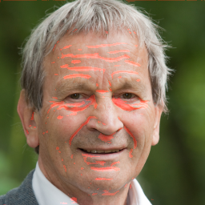

# Facial Wrinkles Detection with UNet

This project utilizes a UNet convolutional neural network for the task of semantic segmentation to detect facial wrinkles. The model has been implemented, trained, and tested manually, followed by hyperparameter tuning using grid search.

## Table of Contents
- [Introduction](#introduction)
- [Dataset](#dataset)
- [Model Architecture](#model-architecture)
- [Training](#training)
- [Hyperparameter Tuning](#hyperparameter-tuning)
- [Results](#results)
- [Usage](#usage)
- [References](#references)

## Introduction
Facial wrinkles detection is a significant task in dermatology and cosmetic science. This project aims to accurately segment facial wrinkles using a UNet model, which is well-suited for image segmentation tasks.

## Dataset
The training data for this project is sourced from the [`Skin-Disease-Detection`](https://github.com/gjain307/Skin-Disease-Detection/tree/master/dataset) project. The dataset includes annotated images of faces with labeled wrinkles.

## Model Architecture
The UNet model is a type of convolutional neural network designed for biomedical image segmentation. It consists of a contracting path to capture context and a symmetric expanding path that enables precise localization.

## Training
The model was trained using the following steps:
1. **Data Preprocessing**: Images were resized and normalized to improve model robustness.
2. **Model Compilation**: The model was compiled with an appropriate optimizer (Adam), loss function (Focal Cross Entropy), and metrics (accuracy and IoU). <u>**Focal Cross Entropy**</u> was used to address class imbalance problem.
3. **Training**: The model was trained on the dataset with a specified number of epochs and batch size.

## Hyperparameter Tuning
Hyperparameters were tuned using grid search to find the optimal combination for the model. Parameters such as learning rate, batch size, and the number of epochs were varied to achieve the best performance.

## Results
The model's performance was evaluated using metrics: accuracy, and IoU (Intersection over Union). The results indicate that the model effectively segments facial wrinkles.

Here are an example of the model's prediction:

## Usage
To use the model for detecting facial wrinkles you need to clone the project and train the model using on of the notebooks.

## References
- [`Skin-Disease-Detection`](https://github.com/gjain307/Skin-Disease-Detection/) project for the training data.
- Ronneberger, O., Fischer, P., & Brox, T. (2015). U-net: Convolutional networks for biomedical image segmentation. In Medical image computing and computer-assisted intervention–MICCAI 2015: 18th international conference, Munich, Germany, October 5-9, 2015, proceedings, part III 18 (pp. 234-241). Springer International Publishing.